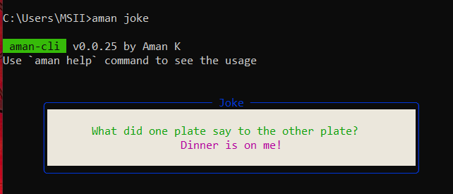
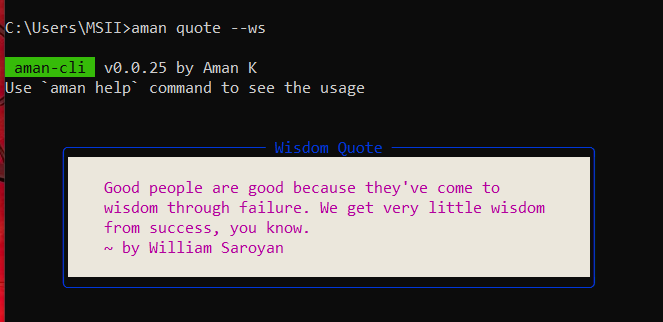
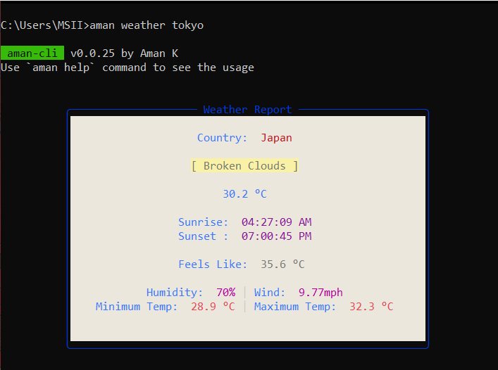

# aman-cli

#### Run this command on your cmd to install this package:

```js
npm install -g aman-cli
```

#### Commands:

```js
aman help - See all the available options
aman joke - Get a random joke
aman quote - Get a random quote
aman weather [city name] - To see the current weather of the city
```

### Joke and Quote
<p align="left">
  
</p>
<p align="right">
  
</p>
<br />
<p align="center">
  
</p>
<br />
