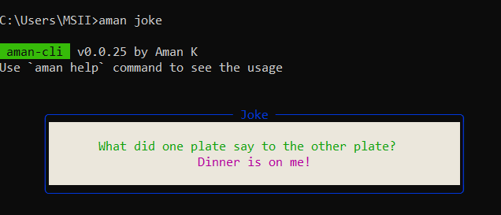

# aman-cli

#### Run this command on your cmd to install this package:

```js
npm install -g aman-cli
```

#### Commands:

```js
aman help - See all the available options
aman joke - Get a random joke
aman quote - Get a random quote
aman weather [city name] - To see the current weather of the city
```

<h2>Joke and Quote</h2>
<p>
  
  
  <br/>
  <p><b>Commands</b></p>
  <p>aman joke</p>
  <p>aman qoute --flag</p>
  <p>aman weather city</p>
  <p align="center">
    <h2>Weather</h2>
  </p>
  <p align="center">
    
  </p>
</p>

